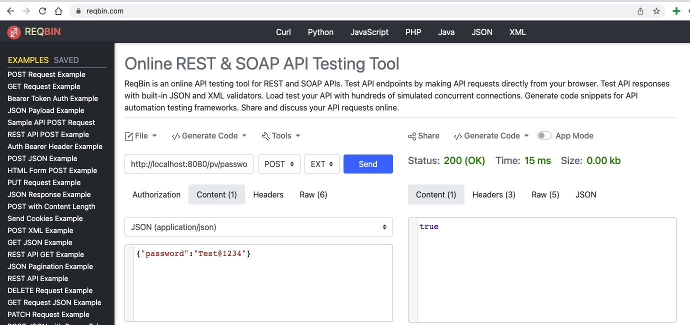
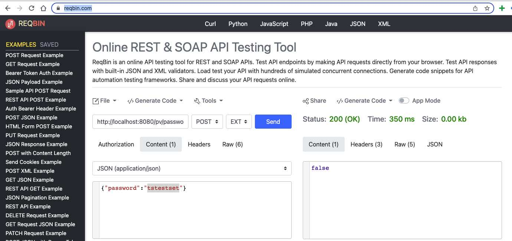

# Spring Boot Password Validation Example

Learn how to integrate Password Validation in your Spring Boot application -

https://github.com/ramanujadasu/passwordvalidation


## Requirements

1. Java - 1.8.x

2. Maven - 3.x.x

```bash
To build code for purposes of password verification. 
Verification will fail if any one of the rules mentioned does not pass.
Implement the following rules. Each one of these will throw an exception with a different message of your choice
1.password should be larger than 8 chars - DONE
2.password should not be null - DONE
3.password should have one uppercase letter at least - DONE
4.password should have one lowercase letter at least - DONE
5.password should have one number at least - DONE
-Add feature: Password is OK if at least three of the previous conditions is true - DONE
-Add feature: password is never OK if item 1.d is not true. - DONE
Assume Each verification takes 1 second to complete. 
Try to solved items 2 and 3 so tests can run faster.
```

## Steps to setup

**1. Clone the application**

```bash
git clone https://github.com/ramanujadasu/passwordvalidation
```

**3. Change any properties as per your installation**

+ open `src/main/resources/application.properties`


**4. Build and run the app using maven**

```bash
cd passwordvalidation
mvn package
java -jar target/passwordvalidation-0.0.1-SNAPSHOT.jar
```

You can also run the app without packaging it using -

```bash
mvn spring-boot:run
```

**5. For API test**

Using CURL:

```bash
1. Example test pass:  curl -X POST http://localhost:8080/pv/password -H "Content-Type: application/json" -d '{"password": "Test@1234"}'
2. Example test failed:  curl -X POST http://localhost:8080/pv/password -H "Content-Type: application/json" -d '{"password": "Test@12"}'
```

Postman or online(https://reqbin.com/)

1. Example test pass: 
2. Example test failed: 

**6. Manually test scenarios**

Enable main method and run the all the usecases: 
CommonUtils.Java 
